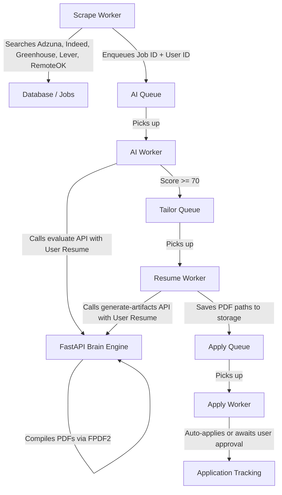

# AI Job Agent

An automated, intelligent job discovery and application platform that searches job boards across global and Indian tech markets (Adzuna, Indeed, Greenhouse, Lever, RemoteOK, LinkedIn), evaluates job fit using local vector embeddings, tailors cover letters and resumes to match job descriptions using Groq LLMs, compiles professional PDFs, and provides an end-to-end user dashboard.

---

## Features

- **User-Uploaded Resumes**: Candidates upload their own resume (PDF or DOCX) during onboarding or in Settings. The system extracts the text and uses your actual experience and skills for semantic scoring and document tailoring—no hardcoded master resumes needed.
- **Indian & Global Region Support**: 
  - Full Adzuna API integration configured for Indian tech listings (Bangalore, Hyderabad, Pune, Mumbai, Delhi/NCR, etc.) and global markets.
  - Indian Indeed integration (`in.indeed.com`) with automated regional location detection.
  - Curated Indian tech watchlist (Razorpay, Swiggy, CRED, Meesho, Postman, Zepto, BrowserStack, PhonePe, Urban Company, InMobi, Groww, Juspay, and more) plus global tech leaders.
- **Experience Level Customization**: Set your seniority level during onboarding (`Entry Level`, `Mid Level`, `Senior Level`, `Lead / Principal`) and adjust it anytime in Search Preferences to tailor search queries and matching criteria.
- **AI Fit Evaluation**: Two-stage evaluation using local MiniLM sentence embeddings for fast semantic pre-filtering and Groq LLMs for detailed fit grading and feedback.
- **Automated Document Tailoring**: Brain Engine dynamically tailors resumes and drafts tailored cover letters targeting specific job requirements, compiled into PDFs via FPDF2.
- **On-Demand Artifacts & Previews**: View and download tailored resumes and cover letters directly from the dashboard, with automatic on-demand generation.
- **Modern Next.js Dashboard**: User authentication, one-time onboarding workflow, real-time application pipeline tracking, daily quota tracking, and full settings management.

---

## System Architecture



- **`frontend/`**: Next.js 14 web application with NextAuth, onboarding flow, interactive dashboard, PDF preview modal, and search settings.
- **`automation-engine/`**: TypeScript/Node.js backend orchestrating BullMQ job queues, scraping workers, Prisma ORM, and MinIO/S3 resume storage.
- **`brain-engine/`**: Python/FastAPI service hosting the semantic embedding models and Groq LLM integrations for resume evaluation and PDF compilation.

---

## State Machine Pipeline

Every job application transitions through clear states:
`FOUND` ➔ `MATCHED` ➔ `TAILORED` ➔ `READY` ➔ `APPLYING` ➔ `SUBMITTED`

- **FOUND**: Job listing discovered and saved to database.
- **MATCHED**: Evaluated against candidate's uploaded resume with score >= 70%.
- **TAILORED**: Custom bullet points and cover letter created for the role.
- **READY**: Tailored PDF resume and cover letter compiled and ready for review/apply.
- **APPLYING**: Browser submission active via Playwright (for supported boards).
- **SUBMITTED**: Application successfully completed.
- **FAILED**: Rejected due to low fit score or error.

---

## Getting Started

### Prerequisites
- [Docker Desktop](https://www.docker.com/products/docker-desktop/) (recommended for containerized deployment)
- Node.js (v18+) & Python (v3.10+) if running services directly on host
- Groq API Key ([console.groq.com](https://console.groq.com/))
- Adzuna Developer Credentials ([developer.adzuna.com](https://developer.adzuna.com/)) for broad job search (India & Global)

---

### Step 1: Environment Configuration

Copy `.env.example` to `.env` in the root repository folder:
```bash
cp .env.example .env
```

Ensure the following key variables are configured:
```env
# Groq API Configuration
GROQ_API_KEY=your_groq_api_key_here
GROQ_MODEL=qwen/qwen3.8-27b

# Adzuna API Configuration (India & Global aggregator)
ADZUNA_APP_ID=your_adzuna_app_id
ADZUNA_APP_KEY=your_adzuna_app_key
ADZUNA_COUNTRY=in

# NextAuth
NEXTAUTH_SECRET=your_nextauth_secret
NEXTAUTH_URL=http://localhost:3002
```

---

### Step 2: Start with Docker Compose (Recommended)

1. Build and boot all services:
   ```bash
   docker compose up -d --build
   ```

2. The services will be accessible at:
   - **Frontend Dashboard**: `http://localhost:3002`
   - **Automation Engine API**: `http://localhost:3000`
   - **Brain Engine Docs**: `http://localhost:8000/docs`
   - **MinIO Storage Console**: `http://localhost:9001` (login: `minioadmin` / `minioadmin`)

---

### Step 3: Candidate Onboarding Flow

1. Navigate to **`http://localhost:3002`** and register/sign in.
2. The initial login initiates the **one-time onboarding**:
   - **Upload Resume**: Upload your real resume (`.pdf` or `.docx`). The system parses and stores your text.
   - **Job Titles**: Specify your target roles (e.g. `Software Engineer, Backend Developer`).
   - **Locations**: Specify target cities or regions (e.g. `Bangalore, Hyderabad, Remote, India`).
   - **Experience Level**: Select your seniority (`Entry`, `Mid`, `Senior`, `Lead`).
   - **Job Boards**: Choose sources (Adzuna, Indeed, Greenhouse, Lever, RemoteOK, etc.).
3. Once completed, your dashboard displays live matches and evaluation scores. You can update any of these preferences or upload a new resume anytime in **Settings** (`/settings`).

---

## Running Services Directly on Host (Without Docker)

### 1. Database & Cache
Ensure PostgreSQL (port 5432), Redis (port 6379), and MinIO (port 9000) are running.

### 2. Brain Engine (Python)
```bash
cd brain-engine
python -m venv venv
# Windows:
.\venv\Scripts\activate
# Linux/macOS:
source venv/bin/activate

pip install -r requirements.txt
python main.py
```

### 3. Automation Engine (Node.js / TypeScript)
```bash
cd automation-engine
npm install
npx prisma generate
npx prisma db push
npm run dev
```

### 4. Frontend (Next.js)
```bash
cd frontend
npm install
npx prisma generate
npm run dev
```

---

## Running Test Suites

- **TypeScript tests** (Vitest):
  ```bash
  cd automation-engine
  npm run test
  ```
- **Python tests** (pytest):
  ```bash
  cd brain-engine
  pytest
  ```

---

## ⚠️ LinkedIn Policy Notice

Auto-submission on LinkedIn is disabled by default to respect platform policies and protect user accounts. LinkedIn listings reach `READY` status on the dashboard where users can review the tailored resume/cover letter and click through to submit manually. Greenhouse and Lever career page applications can auto-apply when enabled.
